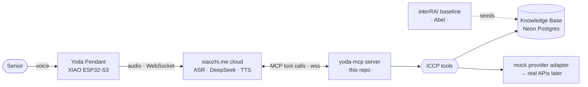

# Yoda MCP — Conversational community-care tools

Yoda is a voice-first AI necklace for elderly Singaporeans. A senior just **talks** — no app, no
screen, no forms — and Yoda arranges real help: signing up for community activities, meal delivery,
and (human-in-the-loop) escalation to a caseworker.

This repo is the **MCP server**: the "tool belt" the hosted Yoda agent (DeepSeek on xiaozhi.me) calls
when a senior speaks. The pendant and the AI brain stay unchanged — we just give the brain tools.

## The Problem

Singapore's community-care services exist, but they're fragmented across portals, hotlines, and
20-question intake forms. The seniors who need them most struggle with apps and don't know where to
start. Yoda removes the friction: it already knows the senior (from her interRAI profile) and turns a
20-question form into a 10-second conversation.

## What it does

- **Knows the senior** — reads her knowledge base so it never re-asks what's on file.
- **Matches activities** — scores 22 upcoming community classes against her goals, day, and location.
- **Books + remembers** — confirms the booking and writes it back to her profile.
- **Meals** — books a hot-meal delivery by voice.
- **Human-in-the-loop** — anything medical/emergency is handed to a Care Corner caseworker, not decided by AI.

## Architecture



The pendant never knows the tools exist — the **cloud LLM** calls them and speaks the result back.

## File structure

```
yoda-mcp/
├── yoda_iccp.py        # MCP server — the tool definitions (what the LLM calls)
├── services.py         # mock provider adapter (book_meal, book_activity)
├── events.py           # 22 community events (all after 23 Jun) + match_events scorer
├── onboarding.py       # short onboarding questions (PRD order)
├── kb_store.py         # knowledge-base load + deep-merge save (local JSON / Supabase seam)
├── mcp_pipe.py         # connects the server OUT to the xiaozhi MCP endpoint
├── SYSTEM_PROMPT.md    # the Yoda agent prompt — paste into xiaozhi.me → Configure Role
├── data/profiles/
│   └── mdm-tan.json    # demo senior's KB: interRAI baseline (Abel) + appended bookings
├── test_match.py       # matching + KB deep-merge tests
├── test_services.py    # service-layer tests
├── requirements.txt
└── .env                # MCP_ENDPOINT secret — gitignored, never committed
```

## Tools

| Tool | What it does |
|------|--------------|
| `get_senior_profile` | Recall who Yoda is talking to (name, area, prefs, risk flags) — call first |
| `get_onboarding_questions` | The short sign-up questions (skip any already on file) |
| `match_events` | Top 1–2 community activities for her goals / day / location |
| `book_aac_activity` | Book a class, return a spoken confirmation |
| `update_knowledge_base` | Merge new prefs + append the booking to her profile |
| `book_meal_delivery` | Book a hot-meal delivery |

## Setup

```bash
python -m venv .venv
.venv\Scripts\activate            # Windows  (source .venv/bin/activate on macOS/Linux)
pip install -r requirements.txt

# create .env with the endpoint from xiaozhi.me console → MCP Settings → "Get MCP Endpoint"
#   MCP_ENDPOINT=wss://api.xiaozhi.me/mcp/?token=...   ← secret, never commit

python mcp_pipe.py yoda_iccp.py   # connects to xiaozhi; the agent can now call the tools
```

Then in the xiaozhi.me console: paste `SYSTEM_PROMPT.md` into the agent's role, hit **Refresh** on the
MCP endpoint (it flips to **Connected**), and talk to the pendant.

## Knowledge base — the contract with Abel

The senior's profile (`data/profiles/<id>.json`) is **one shared file**. Abel's interRAI onboarding
seeds the clinical/functional baseline; this server reads it for context and **appends** preferences +
bookings under `yoda_profile`. Don't fork a second format.

Storage backends (set `KB_BACKEND` in `.env`):
- **`neon`** — Neon Postgres, a `profiles(senior_id text pk, data jsonb)` upsert. This is the shared DB
  Abel's onboarding also writes to. Needs `DATABASE_URL` in `.env`.
- **`local`** (default) — a JSON file under `data/profiles/`. Bulletproof, offline — a safe fallback
  if venue WiFi dies mid-demo.

The seam is in `kb_store.py` (one `_neon_load` / `_neon_save` pair).

## Tests

```bash
pytest          # matching, scoring, KB merge, services  (9 tests)
```

All tools are also verifiable end-to-end over the MCP protocol with an in-memory `fastmcp.Client`
(profile → match → book → save) — no hardware required.

## Why everything is "mocked"

No Singapore provider (Care Corner, AIC/ICCP, Meals-on-Wheels) exposes a public booking API — it's all
phone/email/referral. So the tools return realistic confirmations now, with a one-function seam in
`services.py` to swap in a real `httpx` call the day an API exists. This *is* the pitch's "API-first,
ready to plug in as integrations come online."

## Security

The `MCP_ENDPOINT` token is a secret tied to your agent — keep it in `.env` (gitignored), never in the
deck or a public repo. Rotate it via **Refresh** in the xiaozhi.me console if it ever leaks.
