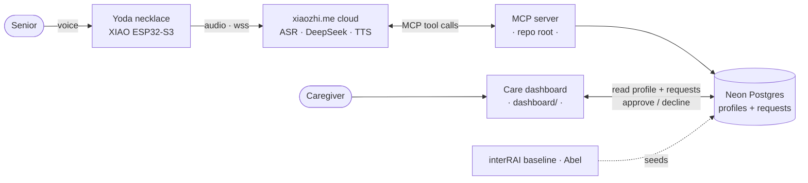

# Yoda — voice-first community care for elderly Singaporeans

Yoda has **two sides**, and this is the monorepo for both:

- **The necklace** — a senior just *talks*. Yoda asks one short question at a time, already knows her
  (from her interRAI profile), and **requests** help on her behalf.
- **The caregiver dashboard** — a human (her caregiver, "Linda") sees Yoda's requests and **approves or
  declines** them. *AI is the interface; a human makes the decision.*

The pendant runs unchanged stock firmware; the AI brain is hosted DeepSeek on `xiaozhi.me`. This repo
adds the **tools** that brain can call (an MCP server) and the **dashboard** the caregiver controls.

## The problem

Singapore's community-care services exist but are fragmented across portals, hotlines, and 20-question
intake forms. The seniors who need them most struggle with apps. Yoda turns a 20-question form into a
10-second conversation — and keeps a human in the loop so the AI never books anything on its own.

## How it works — human in the loop

1. Senior: *"I'm bored."* → Yoda asks **one** question, uses what it already knows, suggests **one** class.
2. She says yes → Yoda calls `request_activity`, which writes a **pending request** to the database.
   Yoda says *"I'll ask Linda to set that up"* — it does **not** book.
3. The caregiver opens the dashboard → **Needs your approval** → **Approve & book** (or Decline).
4. Approved activities move to **Confirmed**. Yoda never re-suggests an event already requested.

## Architecture



The pendant never knows the tools exist — the **cloud LLM** calls them. The **dashboard** and the MCP
server never talk to each other directly; they meet at the shared **Neon** database.

## Repo structure (monorepo)

```
yoda-mcp/                        ← repo root: the MCP server (Python)
├── yoda_iccp.py                 # MCP tools the cloud LLM calls
├── services.py                  # mock provider adapter (book_meal)
├── events.py                    # 22 events + match_events (excludes already-requested)
├── onboarding.py                # short onboarding questions
├── kb_store.py                  # profile load + deep-merge save (Neon / local file)
├── requests_db.py               # activity requests: create / list / decide (Neon)
├── mcp_pipe.py                  # connects the server OUT to the xiaozhi MCP endpoint
├── SYSTEM_PROMPT.md             # the Yoda agent prompt — paste into xiaozhi.me
├── data/profiles/mdm-tan.json   # demo senior KB seed (local-backend fallback)
├── test_match.py · test_services.py
├── requirements.txt
├── .env                         # MCP_ENDPOINT + DATABASE_URL — gitignored, never committed
│
└── dashboard/                   ← the Next.js caregiver dashboard
    ├── app/
    │   ├── care-dashboard.tsx    # the live UI (SWR polls every 3s)
    │   ├── page.tsx · layout.tsx · globals.css
    │   └── api/
    │       ├── profile/route.ts  # GET profile + requests (live)
    │       └── requests/route.ts # POST approve / decline
    ├── lib/db.ts                 # Neon queries: profile, requests, decideRequest
    ├── package.json · tsconfig.json · ...
    └── .env.local                # DATABASE_URL (same Neon DB) — gitignored
```

## MCP tools (`yoda_iccp.py`)

| Tool | What it does |
|------|--------------|
| `get_senior_profile` | Recall who Yoda is talking to (name, area, prefs) — call first |
| `get_onboarding_questions` | Short sign-up questions — ask only what's not already on file |
| `match_events` | Top 1–2 activities for her goals/day/location; **excludes events already requested** |
| `request_activity` | Create a **pending request** for the caregiver. Yoda never books directly. |
| `update_knowledge_base` | Save preferences learned this conversation |
| `book_meal_delivery` | Mock meal-delivery booking |

## The database (Neon Postgres)

Two tables, shared between the MCP server and the dashboard:

- **`profiles(senior_id text pk, data jsonb)`** — the knowledge base: Abel's interRAI baseline + Yoda's
  appended preferences + confirmed activities. (Set `KB_BACKEND=local` to use `data/profiles/*.json`
  instead — a bulletproof offline fallback.)
- **`requests(id, senior_id, event jsonb, status, reference, …)`** — the request → approval workflow.

## Run it

**1 — MCP server** (repo root)
```bash
python -m venv .venv
.venv\Scripts\activate            # Windows (source .venv/bin/activate elsewhere)
pip install -r requirements.txt
# .env:  MCP_ENDPOINT=wss://api.xiaozhi.me/mcp/?token=...   (from the console)
#        DATABASE_URL=postgresql://...                       (Neon)   — both secret
python mcp_pipe.py yoda_iccp.py
```
Then in the xiaozhi.me console: paste `SYSTEM_PROMPT.md` into the agent's role, **Refresh** the MCP
endpoint (→ Connected). Run **only one** MCP server at a time.

**2 — Caregiver dashboard** (`dashboard/`)
```bash
cd dashboard
npm install
# .env.local:  DATABASE_URL=postgresql://...   (the same Neon DB)
npm run dev                        # http://localhost:3000
```

## Tests

```bash
pytest          # matching, scoring, KB merge, services  (8 tests)
```
The full tool flow is also verifiable over the MCP protocol with an in-memory `fastmcp.Client`
(profile → match → request → approve) — no hardware required.

## Why everything is "mocked"

No Singapore provider (Care Corner, AIC/ICCP, Meals-on-Wheels) exposes a public booking API — it's all
phone/email/referral. The tools return realistic results now, with a one-function seam in `services.py`
to drop in a real `httpx` call the day an API exists. That *is* the pitch's "API-first, ready as
integrations come online."

## Security

`MCP_ENDPOINT` and `DATABASE_URL` are secrets — kept in `.env` / `.env.local` (both gitignored), never
committed or shown in the deck. Rotate the MCP token via **Refresh** in the console if it ever leaks.
