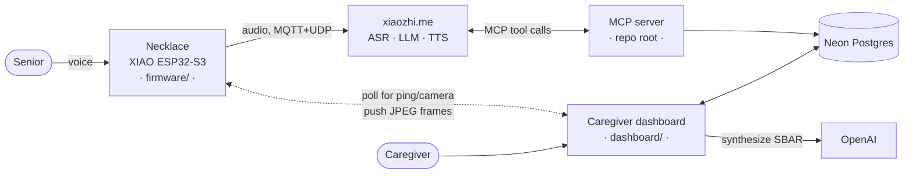

# Yoda

A voice-first care necklace for elderly people living alone. She talks to it. It talks to her caregiver.

**[Demo video](https://www.youtube.com/watch?v=fLG9y0mhrLA)** · Top 5 Finalist, Dell InnovateDash 2026 (Care Corner)

> The wake word is "Jarvis". Espressif only ships a handful of pre-trained wake words and "Yoda" isn't one of them, so the repo kept the original name.

## Why

Singapore's community care services do exist. They are just scattered across portals, hotlines and 20-question intake forms, and the people who need them most are the least likely to get through an app to reach them. Someone who can talk to a necklace does not have to navigate any of that, and her caregiver still makes every decision.

## What it does

**Daily check-in.** The necklace starts a short recovery check-in on its own, tailored to what's on her record. Did you take your heart medicine. How's the cut on your chest. Any tightness or trouble breathing. Her answers become a health incident, and the dashboard turns that into an SBAR clinical handover a caregiver or a paramedic can actually act on.

**Welfare escalation.** If a caregiver can't reach her at the door or by phone, they ping the necklace from the dashboard. It beeps and asks her to respond. Only if she doesn't answer does the camera unlock, and only after the necklace has said out loud that it's turning on.

One rule underneath both: **the AI never acts alone.** Every action it wants to take becomes a request a human approves first.

## Architecture



The cloud LLM is the only thing that calls the tools. The dashboard and the MCP server never talk to each other directly, they meet at the database.

## The parts that were actually hard

**The MCP server dials out.** A hosted LLM can't reach a tool server sitting on a laptop behind NAT. So `mcp_pipe.py` opens the WebSocket in the other direction, to the cloud's MCP endpoint, and pipes it to a local stdio FastMCP process. No port forwarding, no public IP, no tunnel service.

**The emergency watchdog is a SQL expression, not a worker.** If she starts a health check and then goes quiet, that silence has to become an alert. Instead of a cron job or a background queue, the escalation is derived at query time:

```sql
CASE WHEN status = 'in_progress' AND now() - started_at > make_interval(secs => 25)
     THEN 'emergency' ...
```

The dashboard already polls every 3s, so the escalation just appears. Nothing to schedule, nothing to keep alive, nothing to crash silently.

**Seeing her from anywhere, with zero setup.** The first version needed the caregiver on the same Wi-Fi to reach the necklace's LAN server. Useless in practice. Now the necklace polls the dashboard for commands and pushes JPEG frames up over HTTPS, so everything is outbound. Works on a mobile hotspot, no router config.

**That relay was quietly killing the wake word.** After adding the relay, "Jarvis" stopped triggering. The cause was a fresh TLS handshake every 2 seconds hogging the CPU and starving the on-chip wake-word detector, which needs a steady mic feed. Throttling the idle poll to 15s brought it back. The camera stream still starves it while running, which is fine, that path is caregiver-initiated.

**Privacy is enforced on the device, not the dashboard.** The camera can't be turned on cold. It only unlocks after a ping goes unanswered, and the necklace speaks an announcement before the lens opens.

## What's real and what's mocked

Real: the voice loop, the tool calls, the database, the triage and escalation, the SBAR report, the camera relay, the firmware.

Mocked: the service providers. No Singapore community-care provider (Care Corner, AIC/ICCP, Meals-on-Wheels) exposes a public booking API, it's all phone, email and referral forms. The tools return realistic results and `services.py` keeps a one-function seam to drop in a real `httpx` call the day an API exists.

Also worth saying plainly: the firmware is a custom board overlay on [`78/xiaozhi-esp32`](https://github.com/78/xiaozhi-esp32) (MIT), not a from-scratch stack. The board definition, welfare HTTP API, cloud relay and camera path are mine.

## Repo layout

```
yoda-mcp/
├── yoda_iccp.py          # the 8 tools the cloud LLM can call
├── mcp_pipe.py           # dials OUT to the cloud MCP endpoint
├── health_db.py          # triage + the no-response escalation
├── kb_store.py           # senior profile load/merge (Neon or local file)
├── events.py             # activity matching
├── services.py           # mock provider adapter (the real-API seam)
├── SYSTEM_PROMPT.md      # the agent prompt, pasted into the xiaozhi console
├── test_*.py             # 14 tests
│
├── firmware/yoda-pendant/    # board overlay: config, welfare HTTP API, cloud relay
├── dashboard/                # Next.js caregiver dashboard
│   ├── app/                  # care view, welfare panel, SBAR report page
│   └── lib/                  # Neon queries + OpenAI report synthesis
└── cad/pendant_case.py       # parametric enclosure (build123d) -> printable STL
```

## The tools

| Tool | What it does |
|------|--------------|
| `get_senior_profile` | Recall who it's talking to. Called first, so it never re-asks what's on file. |
| `begin_health_check` | Open an incident the moment she reports feeling unwell. Starts the silence timer. |
| `complete_health_check` | File the triage with clinical red flags → `mild` / `serious` |
| `match_events` | Top 1-2 activities for her goals and area, excluding ones already requested |
| `request_activity` | Create a **pending request** for the caregiver. Never books directly. |
| `update_knowledge_base` | Save preferences learned in conversation |
| `get_onboarding_questions` | Short sign-up questions, only what isn't already known |
| `book_meal_delivery` | Mock meal booking |

## Run it

**MCP server** (repo root)

```bash
python -m venv .venv && .venv\Scripts\activate
pip install -r requirements.txt
# .env:  MCP_ENDPOINT=wss://api.xiaozhi.me/mcp/?token=...
#        DATABASE_URL=postgresql://...
python mcp_pipe.py yoda_iccp.py
```

Then paste `SYSTEM_PROMPT.md` into the xiaozhi.me console as the agent's role and hit Refresh on the MCP endpoint. Run only one MCP server at a time.

**Dashboard**

```bash
cd dashboard && npm install
# .env.local:  DATABASE_URL=...  OPENAI_API_KEY=...
npm run dev
```

**Tests**

```bash
pytest          # 14 tests: matching, KB merge, services, triage + escalation
```

## Security

`MCP_ENDPOINT`, `DATABASE_URL` and `OPENAI_API_KEY` live in `.env` / `.env.local`, both gitignored and never committed. The device token in `firmware/yoda-pendant/config.h` is a placeholder in this repo. Rotate the MCP token from the console if it ever leaks.
